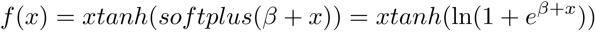
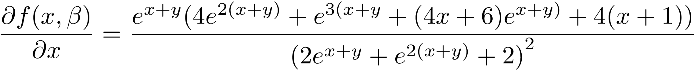
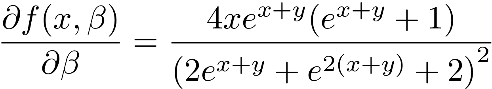
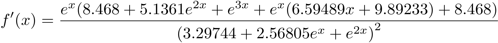
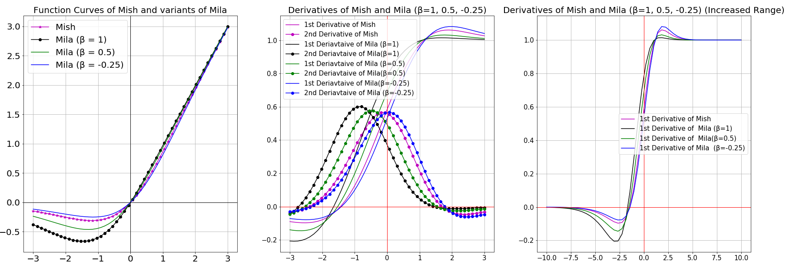
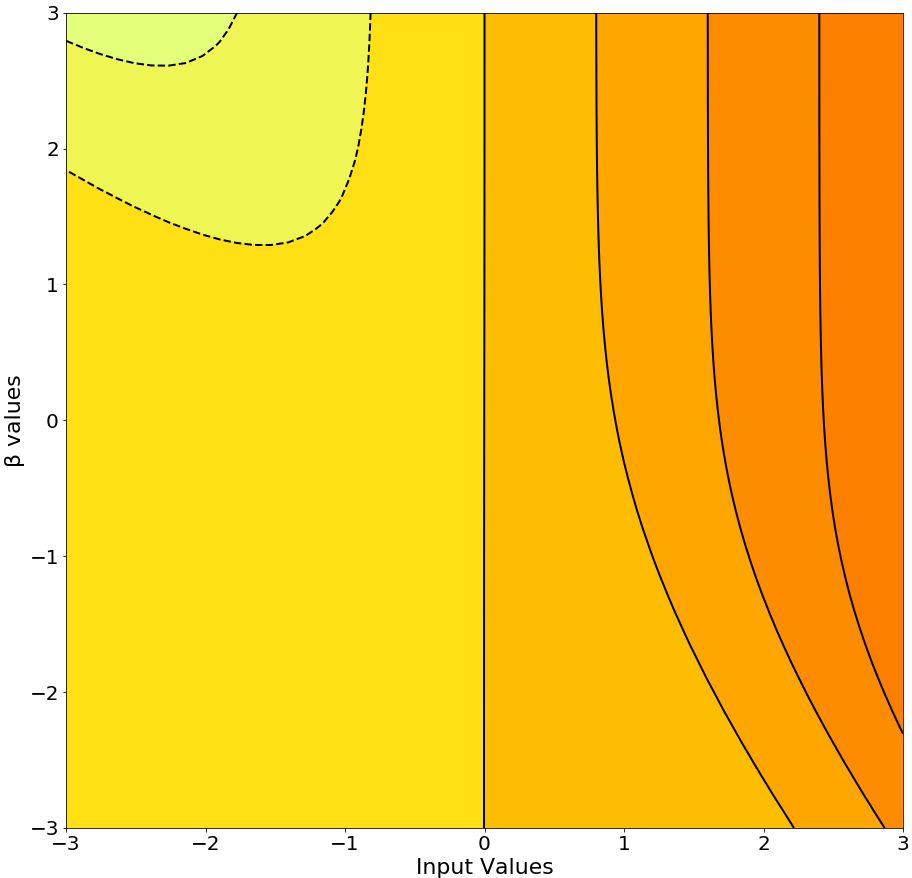
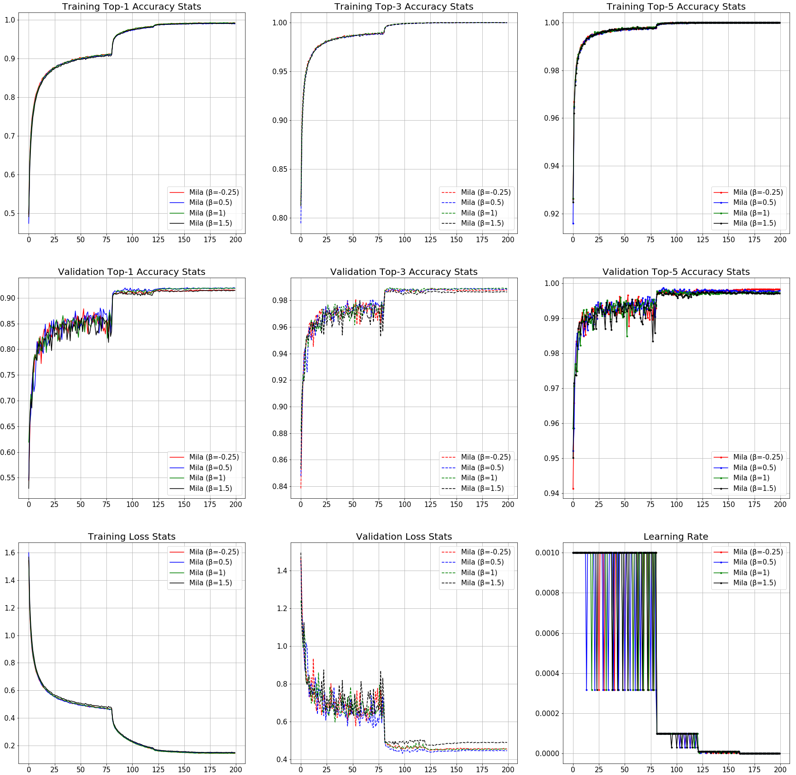

# Mila

*Mila* is an uniparametric activation function inspired from the Mish Activation Function. The parameter β is used to control the concavity of the Global Minima of the Activation Function where β=0 is the baseline Mish Activation Function. Varying β in the negative scale reduces the concavity and vice versa. β is introduced to tackle gradient death scenarios due to the sharp global minima of Mish Activation Function. 

The mathematical function of Mila is shown as below:

It's partial derivatives:

1st derivative of Mila when β=-0.25:

Function and it's derivatives graphs for various values of β:

Contour Plot of Mila and it's 1st derivative:

## Benchmarks:

### CIFAR-10:

#### ResNet v1:

##### ResNet-20:

|Activation Function| Top-1 Accuracy| Loss|
|---|---|---|
|Mish|91.81%|4.47284%|
|Swish-1|**91.95%**|**4.440651%**|
|ReLU|91.5%|4.94356%|
|β-Mish (β = 1.5)|91.75%|4.4894%|
|Mila (β = 1)|91.85%|4.5375%|
|Mila (β = -0.25)|91.9%|4.4655%|
|Mila (β = 1.5)|91.44%|4.8906%|
|Mila (β = 0.5)|91.48%|4.5398%|

## Try it

Run the demo.py file to try out Mila in a simple network for Fashion MNIST classification.

- First clone the repository and navigate to the folder using the following command. 

> cd \path_to_Mila_directory

- Install dependencies

> pip install requirements.txt

- Run the Python demo script. 

> python3 demo.py --activation mila --model_initialization class

*Note: The demo script is initialized with Mila having a β to be -0.25. Change the β ('beta' variable) in the script to try other beta values*
