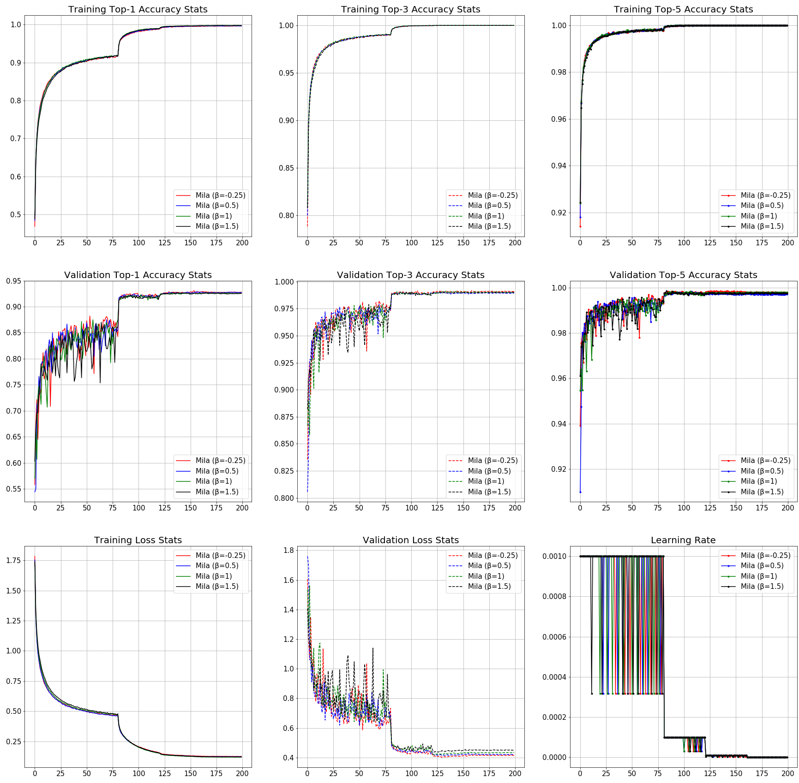

# Mila

*Mila* is an uniparametric activation function inspired from the Mish Activation Function. The parameter β is used to control the concavity of the Global Minima of the Activation Function where β=0 is the baseline Mish Activation Function. Varying β in the negative scale reduces the concavity and vice versa. β is introduced to tackle gradient death scenarios due to the sharp global minima of Mish Activation Function. 

The mathematical function of Mila is shown as below:

It's partial derivatives:

1st derivative of Mila when β=-0.25:

Function and it's derivatives graphs for various values of β:

Contour Plot of Mila and it's 1st derivative:

## Benchmarks:

### CIFAR-10:

#### ResNet v1:

##### ResNet-20:

|Activation Function| Top-1 Accuracy| Loss|
|---|---|---|
|Mish|91.81%|4.47284%|
|Swish-1|**91.95%**|**4.440651%**|
|ReLU|91.5%|4.94356%|
|β-Mish (β = 1.5)|91.75%|4.4894%|
|Mila (β = 1)|91.85%|4.5375%|
|Mila (β = -0.25)|91.9%|4.4655%|
|Mila (β = 1.5)|91.44%|4.8906%|
|Mila (β = 0.5)|91.48%|4.5398%|

##### ResNet-32: 

|Activation Function| Top-1 Accuracy| Loss|
|---|---|---|
|Mish|92.29%|4.3543639%|
|ReLU|91.78%|4.51267568%|
|Swish-1|92.3%|4.31110565%|
|β-Mish (β = 1.5)|**92.49%**|4.49838%|
|Mila (β = 1)|92.38%|4.36164%|
|Mila (β = -0.25)|92.47%|**4.2691%**|
|Mila (β = 1.5)|92.33%|4.58325%|
|Mila (β = 0.5)|92.42%|4.39018%|

##### ResNet-44: 

|Activation Function| Top-1 Accuracy| Loss| Top-3 Accuracy | Top-5 Accuracy|
|---|---|---|---|---|
|Mish|92.46%|4.4195%|99%|**99.82%**|
|Swish-1|**92.84%**|**4.1272%**|98.96%|**99.82%**|
|ReLU|92.33%|4.30961%|98.89%|99.73%|
|Mila (β = 1)|92.58%|4.34736%|98.99%|99.79%|
|Mila (β = 0.5)|92.74%|4.21489%|98.93%|99.7%|
|Mila (β = 1.5)|92.56%|4.49745%|99.01%|99.75%|
|Mila (β = -0.25)|92.78%|4.13684%|**99.08%**|99.8%|

##### ResNet-56:

|Activation Function| Top-1 Accuracy|Loss| Top-3 Accuracy| Top-5 Accuracy| 
|---|---|---|---|---|
|Mish|92.21%|4.3387%|**99.09%**|**99.85%**|
|Swish-1|91.85%|4.33817%|98.92%|**99.85%**|
|ReLU|91.97%|4.34036%|98.91%|99.74%|
|ELU(α=1.0)|91.48%|4.39%|98.88%|99.78%|
|SELU|90.41%|4.56946%|98.8%|99.75%|
|Mila (β = 1)|92.22%|4.56449%|98.97%|99.63%|
|Mila (β = 0.5)|92.31%|4.61664%|98.96%|99.74%|
|Mila (β = 1.5)|**92.7%**|4.45469%|98.83%|99.65%|
|Mila (β = -0.25)|92.59%|**4.29828%**|98.98%|99.81%|

##### ResNet-110:

|Activation Function| Top-1 Accuracy| Loss|Top-3 Accuracy| Top-5 Accuracy| 
|---|---|---|---|---|
|Mish|91.44%|4.672%|98.75%|99.6%|
|Swish-1|91.34%|4.7418%|98.86%|99.76%|
|ReLU|91.69%|4.4194%|98.9%|99.77%|
|ELU(α=1.0)|91.66%|**4.171%**|**98.92%**|99.67%|
|Mila (β = 1)|**91.86%**|4.6462%|98.9%|99.69%|
|Mila (β = 0.5)|91.57%|4.6397%|98.85%|**99.8%**|
|Mila (β = 1.5)|91.82%|4.72402%|98.71%|99.67%|
|Mila (β = -0.25)|91.43%|4.49743%|98.75%|99.69%|

##### ResNet-164:

|Activation Function| Top-1 Accuracy| Loss|Top-3 Accuracy| Top-5 Accuracy| 
|---|---|---|---|---|
|Mish|83.62%|7.7867%|96.81%|99.11%|
|Swish-1|82.19%|9.046%|96.43%|99.18%|
|ReLU|82.37%|8.09783%|95.48%|98.48%|
|Mila (β = 1)|80.21%|8.59806%|96.08%|98.9%|
|Mila (β = 0.5)|83.89%|7.36526%|97.01%|99.28%|
|Mila (β = 1.5)|79.63%|9.00763%|95.39%|98.81%|
|Mila (β = -0.25)|**86.33%**|**6.64551%**|**97.64%**|**99.38%**|

## Try it

Run the demo.py file to try out Mila in a simple network for Fashion MNIST classification.

- First clone the repository and navigate to the folder using the following command. 

> cd \path_to_Mila_directory

- Install dependencies

> pip install requirements.txt

- Run the Python demo script. 

> python3 demo.py --activation mila --model_initialization class

*Note: The demo script is initialized with Mila having a β to be -0.25. Change the β ('beta' variable) in the script to try other beta values*
