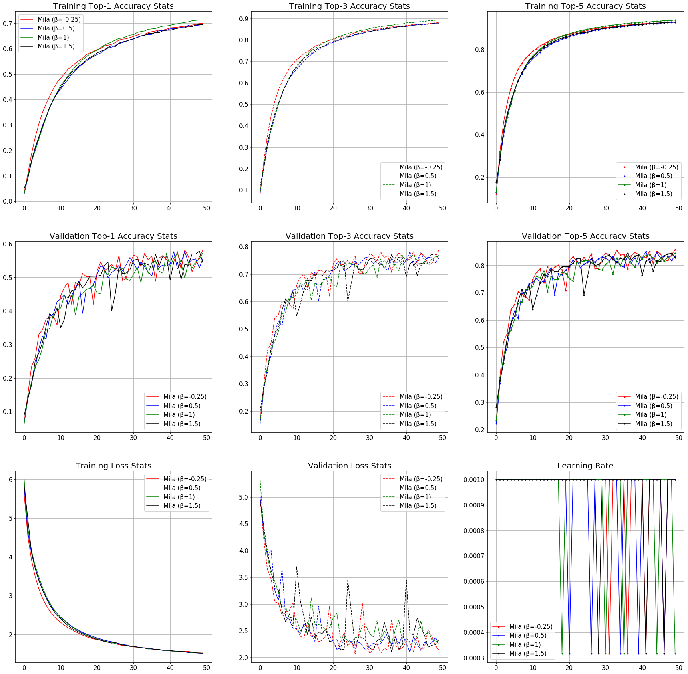

# Benchmarks:

## CIFAR-10:

### ResNet v1:

#### ResNet-20:

|Activation Function| Top-1 Accuracy| Loss|
|---|---|---|
|Mish|91.81%|4.47284%|
|Swish-1|**91.95%**|**4.440651%**|
|ReLU|91.5%|4.94356%|
|β-Mish (β = 1.5)|91.75%|4.4894%|
|Mila (β = 1)|91.85%|4.5375%|
|Mila (β = -0.25)|91.9%|4.4655%|
|Mila (β = 1.5)|91.44%|4.8906%|
|Mila (β = 0.5)|91.48%|4.5398%|

#### ResNet-32: 

|Activation Function| Top-1 Accuracy| Loss|
|---|---|---|
|Mish|92.29%|4.3543639%|
|ReLU|91.78%|4.51267568%|
|Swish-1|92.3%|4.31110565%|
|β-Mish (β = 1.5)|**92.49%**|4.49838%|
|Mila (β = 1)|92.38%|4.36164%|
|Mila (β = -0.25)|92.47%|**4.2691%**|
|Mila (β = 1.5)|92.33%|4.58325%|
|Mila (β = 0.5)|92.42%|4.39018%|

#### ResNet-44: 

|Activation Function| Top-1 Accuracy| Loss| Top-3 Accuracy | Top-5 Accuracy|
|---|---|---|---|---|
|Mish|92.46%|4.4195%|99%|**99.82%**|
|Swish-1|**92.84%**|**4.1272%**|98.96%|**99.82%**|
|ReLU|92.33%|4.30961%|98.89%|99.73%|
|Mila (β = 1)|92.58%|4.34736%|98.99%|99.79%|
|Mila (β = 0.5)|92.74%|4.21489%|98.93%|99.7%|
|Mila (β = 1.5)|92.56%|4.49745%|99.01%|99.75%|
|Mila (β = -0.25)|92.78%|4.13684%|**99.08%**|99.8%|

#### ResNet-56:

|Activation Function| Top-1 Accuracy|Loss| Top-3 Accuracy| Top-5 Accuracy| 
|---|---|---|---|---|
|Mish|92.21%|4.3387%|**99.09%**|**99.85%**|
|Swish-1|91.85%|4.33817%|98.92%|**99.85%**|
|ReLU|91.97%|4.34036%|98.91%|99.74%|
|ELU(α=1.0)|91.48%|4.39%|98.88%|99.78%|
|SELU|90.41%|4.56946%|98.8%|99.75%|
|Mila (β = 1)|92.22%|4.56449%|98.97%|99.63%|
|Mila (β = 0.5)|92.31%|4.61664%|98.96%|99.74%|
|Mila (β = 1.5)|**92.7%**|4.45469%|98.83%|99.65%|
|Mila (β = -0.25)|92.59%|**4.29828%**|98.98%|99.81%|

#### ResNet-110:

|Activation Function| Top-1 Accuracy| Loss|Top-3 Accuracy| Top-5 Accuracy| 
|---|---|---|---|---|
|Mish|91.44%|4.672%|98.75%|99.6%|
|Swish-1|91.34%|4.7418%|98.86%|99.76%|
|ReLU|91.69%|4.4194%|98.9%|99.77%|
|ELU(α=1.0)|91.66%|**4.171%**|**98.92%**|99.67%|
|Mila (β = 1)|**91.86%**|4.6462%|98.9%|99.69%|
|Mila (β = 0.5)|91.57%|4.6397%|98.85%|**99.8%**|
|Mila (β = 1.5)|91.82%|4.72402%|98.71%|99.67%|
|Mila (β = -0.25)|91.43%|4.49743%|98.75%|99.69%|

#### ResNet-164:

|Activation Function| Top-1 Accuracy| Loss|Top-3 Accuracy| Top-5 Accuracy| 
|---|---|---|---|---|
|Mish|83.62%|7.7867%|96.81%|99.11%|
|Swish-1|82.19%|9.046%|96.43%|99.18%|
|ReLU|82.37%|8.09783%|95.48%|98.48%|
|Mila (β = 1)|80.21%|8.59806%|96.08%|98.9%|
|Mila (β = 0.5)|83.89%|7.36526%|97.01%|99.28%|
|Mila (β = 1.5)|79.63%|9.00763%|95.39%|98.81%|
|Mila (β = -0.25)|**86.33%**|**6.64551%**|**97.64%**|**99.38%**|

### ResNet v2:

#### ResNet-20:

|Activation Function|Testing Top-1 Accuracy|Testing Loss|
|---|---|---|
|Aria-2(β = 1, α=1.5)|91.73%|4.25074%|
|Bent's Identity|89.1%|4.52398%|
|ELU(α=1.0)|91.58%|**4.05194%**|
|Hard Sigmoid|87.42%|4.86469%|
|Leaky ReLU(α=0.3)|90.57%|4.093131%|
|Mish|92.02%|4.19176%|
|PReLU(Default Parameters)|91.25%|4.403224%|
|ReLU|91.71%|4.08291%|
|SELU|90.59%|4.36311%|
|Sigmoid|89.27%|4.474636%|
|SoftPlus|91.39%|4.2238%|
|SoftSign|90.45%|4.402751%|
|Swish-1|91.61%|4.295542%|
|TanH|90.99%|4.3992%|
|Thresholded ReLU(θ=1.0)|76.22%|7.37498%|
|β-Mish (β=1.5)|92.15%|4.18306%|
|Mila (β = 1)|91.84%|4.40175%|
|Mila (β = -0.25)|91.6%|4.22837%|
|Mila (β = 1.5)|**92.16%**|4.28656%|
|Mila (β = 0.5)|92.14%|4.20645%|

#### ResNet-56:

|Activation Function| Top-1 Accuracy| Loss|Top-3 Accuracy| Top-5 Accuracy| 
|---|---|---|---|---|
|Mila (β = 1)|92.47%|4.56534%|98.84%|99.77%|
|Mila (β = 0.5)|92.27%|4.27902%|99.11%|99.77%|
|Mila (β = 1.5)|92.23%|4.47899%|99.07%|**99.82%**|
|Mila (β = -0.25)|**92.93%**|**3.93044%**|**99.13%**|99.8%|
|Mish|92.79%|4.06386%|98.96%|99.77%|
|Swish-1|92.44%|4.3472%|99.02%|99.76%|
|ReLU|92.4%|3.99512%|99.12%|**99.82%**|

#### ResNet-110:

|Activation Function| Top-1 Accuracy| Loss|Top-3 Accuracy| Top-5 Accuracy| 
|---|---|---|---|---|
|Mila (β = 1)|91.92%|4.46735%|98.99%|99.79%|
|Mila (β = 0.5)|92.21%|4.23213%|**99.08%**|**99.83%**|
|Mila (β = 1.5)|91.24%|4.79068%|98.8%|99.79%|
|Mila (β = -0.25)|92.37%|**4.11378%**|99.06%|99.79%|
|Mish|**92.58%**|4.16525%|98.97%|	99.72%|
|Swish-1|	92.22%|	4.16021%|98.99%|99.75%|
|ReLU|91.93%|4.22357%|	98.85%|	99.75%|

#### ResNet-164:

|Activation Function| Top-1 Accuracy| Loss|Top-3 Accuracy| Top-5 Accuracy| 
|---|---|---|---|---|
|Mila (β = 1)|84.5%|7.03236%|97.06%|99.31%|
|Mila (β = 0.5)|84.77%|6.89603%|97.3%|99.33%|
|Mila (β = 1.5)|80.2%|9.03184%|96.6%|99.24%|
|Mila (β = -0.25)|**87.88%**|**5.70955%**|97.97%|99.5%|
|Mish|87.74%|	5.7284%|**98.07%**|	**99.61%**|
|Swish-1|		86.13%|6.4354%|97.55%|99.4%|
|ReLU|83.59%|7.3899%|	96.86%|99.41%|

## CIFAR-100:

### ResNet v1:

#### ResNet-20:

|Activation Function| Top-1 Accuracy| Loss|Top-3 Accuracy| Top-5 Accuracy| 
|---|---|---|---|---|
|Mila (β = 1)|66.58%|16.23801%|84.47%|89.65%|
|Mila (β = 0.5)|66.65%|16.29548%|84.26%|90.01%|
|Mila (β = 1.5)|66.58%|16.45771%|84.14%|89.73%|
|Mila (β = -0.25)|67.23%|15.97333%|**85.2%**|90.2%|
|Mish|**67.26%**|16.10206%|84.77%|90.08%|
|Swish-1|	67.1%|16.11301634%|84.68%|90.24%|
|ReLU|67%	|**15.653861%**|85.08%|	**90.28%**|

#### ResNet-32:

|Activation Function| Top-1 Accuracy| Loss|Top-3 Accuracy| Top-5 Accuracy| 
|---|---|---|---|---|
|Mila (β = 1)|69.02%|17.01307%|86.26%|91.18%|
|Mila (β = 0.5)|68.88%|17.21245%|**86.38%**|91.11%|
|Mila (β = 1.5)|68.89%|17.48514%|85.52%|90.69%|
|Mila (β = -0.25)|68.77%|17.23115%|85.93%|90.94%|
|Mish|**69.44%**|	16.9508%|	86.25%|	**91.27%**|
|Swish-1|68.84%|17.09074%|85.89%|90.96%|
|ReLU|68.45%	|**16.64781%**|	85.94%|	91.05%|

#### ResNet-44:

|Activation Function| Top-1 Accuracy| Loss|Top-3 Accuracy| Top-5 Accuracy| 
|---|---|---|---|---|
|Mila (β = 1)|69.49%|17.58251%|86.46%|91.23%|
|Mila (β = 0.5)|69.3%|17.64013%|**86.5%**|**91.49%**|
|Mila (β = 1.5)|**69.99%**|18.00744%|85.99%|91.04%|
|Mila (β = -0.25)|69.54%|18.04861%|86.08%|90.91%|
|Mish|	69.37%|18.04521%|85.87%|90.97%|
|Swish-1|	69.62%|18.04978%|86.22%|91.08%|
|ReLU|	69.73%|	**16.77497%**|	86%|	91.13%|

#### ResNet-56:

|Activation Function| Top-1 Accuracy| Loss|Top-3 Accuracy| Top-5 Accuracy| 
|---|---|---|---|---|
|Mila (β = 1)|69.73%|17.93878%|86.22%|91.1%|
|Mila (β = 0.5)|69.99%|18.06883%|85.68%|90.81%|
|Mila (β = 1.5)|68.83%|18.54846%|85.94%|91.24%|
|Mila (β = -0.25)|69.17%|18.52378%|85.86%|90.96%|
|Mish|**70.13%**|18.06037%|**86.7%**|	**91.56%**|
|Swish-1|70.02%|	17.73429%|	86.09%|	91.03%|
|ReLU|69.6%	|**17.32434%**|	86.06%|91.07%|

#### ResNet-110:

|Activation Function| Top-1 Accuracy| Loss|Top-3 Accuracy| Top-5 Accuracy| 
|---|---|---|---|---|
|Mila (β = 1)|68.43%|18.35756%|85.53%|90.35%|
|Mila (β = 0.5)|68.2%|18.0997%|85.92%|91.06%|
|Mila (β = 1.5)|**69.43%**|18.60931%|86.1%|**91.21%**|
|Mila (β = -0.25)|67.61%|17.22959%|85.51%|90.54%|
|Mish|	67.64%|17.18773%|85.02%|90.65%|
|Swish-1|67.76%|17.1041962%|85.48%|90.74%|
|ReLU|68.43%|**16.68934%**|	**86.43%**|91.2%|

#### ResNet-164:

|Activation Function| Top-1 Accuracy| Loss|Top-3 Accuracy| Top-5 Accuracy| 
|---|---|---|---|---|
|Mila (β = 1)|57.34%|22.59154%|77%|84.49%|
|Mila (β = 0.5)|55.7%|22.62863%|76.17%|83.4%|
|Mila (β = 1.5)|54.25%|23.21046%|75.69%|82.79%|
|Mila (β = -0.25)|**58.22%**|**21.32837%**|**78.96%**|**85.68%**|
|Mish|52.7%|	24.75166%|73.56%|81.25%|
|Swish-1|55.96%|21.59843%|77.2%|84.3%|
|ReLU|	52.6%|23.473348%|73.58%|81.63%|

